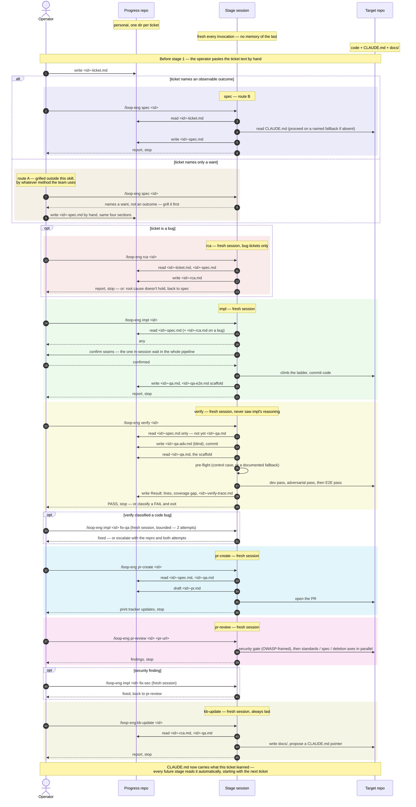

# loop-eng — first three months

A walkthrough for adopting this loop from day one on a new team, in an unfamiliar codebase.

One ticket becomes several focused sessions, each with one job. The only thing crossing between them is what got committed. `SPEC.md` is the full design and the reasoning behind every decision; this file is how to actually start.

---

## The whole pipeline, one ticket

Every stage below is invoked by you, in its own fresh session — nothing here ever chains into the next stage on its own. The two repair loops (`fix-qa`, `fix-sec`) are the only named exceptions to "one stage, one session," and both are still operator-invoked.



Nothing above names a language, a framework, or a host — that's the point: the same diagram is the whole workflow whether the target repo is a web app, a CLI, or (see `example/smb-client-server.md`) two shell scripts wrapping an OS feature.

---

## Where it loops, and what stops each loop

The diagram above runs left to right. What it can't show is the three places work goes *backwards* — and every one of them needs something written down to stop, because each `verify` is a fresh session that remembers nothing.

```mermaid
stateDiagram-v2
    direction LR

    state "SPEC<br/>criteria · non-goals · open gaps" as SPEC
    state "IMPL" as IMPL
    state "VERIFY<br/>author blind → pre-flight →<br/>dev → adversarial → E2E" as VERIFY
    state "PR" as PR

    [*] --> SPEC
    SPEC --> IMPL: every gap ruled
    SPEC --> SPEC: gap open — decider rules, ruling becomes a criterion or a non-goal
    IMPL --> VERIFY
    VERIFY --> PR: all three passes green

    VERIFY --> IMPL: code bug — fix-qa, 2 attempts then escalate
    VERIFY --> SPEC: spec gap — nobody decided this; 0 retries
    VERIFY --> VERIFY: wrong case — operator corrects it, logs why
    VERIFY --> [*]: environment red — 0 retries, go fix the machine
```



| Loop | What's turning | What stops it |
|---|---|---|
| `verify` → `impl` | the code doesn't meet a criterion | 2 attempts, then it escalates to you |
| `verify` → itself | a case was written wrong | the `## Correction log` row |
| `verify` → `spec` | the adversary found something undecided | **the `## Non-goals` line** |

The third one is why `## Non-goals` is required rather than nice to have. Without it, a rejected case looks exactly like an unasked one, so the next fresh session raises it again, and the one after that:

```
no non-goals:   run 1 "what about null?" → "we don't handle null"
                run 2 "what about null?" → "...I just said that"
                run 3 "what about null?" → forever

with them:      run 1 "what about null?" → written into ## Non-goals
                run 2 the case is dropped before it's even written
```

A refusal that lives only in your head gets re-litigated forever. One in the spec is read by every session that follows.

---

## Setup — ten minutes, day one

```bash
git clone git@github.com:Alfons0329/gemini-claude-skill.git ~/skills
mkdir -p ~/.claude/skills
ln -sf ~/skills/productivity/loop-eng    ~/.claude/skills/
ln -sf ~/skills/productivity/writing-skills ~/.claude/skills/
ln -sf ~/skills/productivity/interview-me   ~/.claude/skills/
```

Symlinks rather than copies, so `git pull` updates every installed skill at once.

```bash
mkdir -p ~/progress && cd ~/progress && git init
echo "Personal notes. Real ticket IDs inside. Never add a public remote." > README.md
git add -A && git commit -m "init"
```

Then one line in your **personal** context file, `~/.claude/CLAUDE.md` — not any team repo's:

```
Harness artifacts live under ~/progress/, one directory per ticket ID.
```

Nothing else to install. No config, no CLI, no per-repo copies.

---

## Week 1 — `spec` only

There is no working local stack yet. At a large company that takes one to two weeks. Run the one stage that needs nothing:

```bash
mkdir -p ~/progress/<ticket-id>
# paste the ticket text into ~/progress/<ticket-id>/<ticket-id>-ticket.md

/loop-eng spec <ticket-id>
```

**One of two things comes back**, and the second is not a failure:

- **A spec.** The ticket already named an outcome. Read it — where it's wrong, the ticket was ambiguous, which is now a specific question to ask your team instead of a vague feeling that you are lost.
- **"This names a want, not an outcome."** The stage won't guess a shape for a ticket nobody has pinned down. Grill it yourself — with whatever method you use — and save the result to `<ticket-id>-spec.md` with the same four sections. Downstream, nothing can tell the two apart.

Either way you end up with the same file. **Park what you can't settle in `## Open gaps`, each with options and your recommendation**, and go get it ruled on. `impl` won't start while one is open, which in week one is the point: you are new, and the fastest way to learn who owns what is to need a decision from them.

---

## Month 1 — take bug tickets on purpose

```bash
/loop-eng spec <ticket-id>
/loop-eng rca  <ticket-id>     # bug tickets only
```

`rca` makes you read git history and old commits to explain why a defect shipped.

**A story ticket teaches you where the files are. A bug ticket teaches you why they are like that.** Ask for bugs early, deliberately.

Start each repo's `CLAUDE.md` this month too. Anything you look up twice, write down there. After a few weeks a cold session knows what you know.

`verify` still gets skipped — say so in the PR body, with the reason. Never silently.

---

## Month 2 — the whole loop

The stack works now.

```bash
/loop-eng spec      <ticket-id>
/loop-eng impl      <ticket-id>
/loop-eng verify    <ticket-id>
/loop-eng pr-create <ticket-id>
/loop-eng pr-review <ticket-id> <pr-url>
/loop-eng kb-update <ticket-id>
```

Six sessions. One stage each.

`kb-update` starts paying here: it writes to the target repo's `docs/`, so the team gets what you learned, not just you.

---

## Month 3 — the loop starts improving itself

**Learnings graduate.** Strip every proper noun from something you learned. Still useful → it is a method improvement, and belongs in the kernel skill. Nothing left → it is a repo fact, and belongs in that repo's `CLAUDE.md`.

**A private company skill set begins**, in a separate repo, authored with `/writing-skills`. Prefix those names so they cannot collide with the public set.

---

## Six rules

1. **One stage, one session.** The design rests on this. A session that wrote the code cannot be trusted to test it.
2. **The same `--human` on three tickets running** was never per-ticket context. Move it to `CLAUDE.md`.
3. **Never give `~/progress` a public remote.** Real ticket IDs, real service names, real defect writeups.
4. **A red test is not automatically a code bug.** The control case decides. A broken environment gets zero retries — go fix the machine.
5. **`verify` writes its own cases before it reads `impl`'s.** A plan written by the builder can only test what the builder thought of. The second plan is where the missing case shows up.
6. **Never hand a decider a bare question.** A gap carries options and your recommendation, or it isn't a gap — and if you can't say why the call isn't yours, it is. Make it and move.

---

## Don't fake `verify`

The single discipline that matters most, and the one an agent erodes fastest.

It fails in two ways that look identical from outside:

- **A pass that never ran.** "All six cases pass" when the stack was never up.
- **A pass that ran against nothing real.** A mock so complete it always agrees; a stub standing in for the service. It genuinely executes and genuinely goes green, and proves nothing.

The second is worse, because it is not a lie. Everyone believes it, including whoever wrote it.

A small worked example. The criterion:

```
AC-1  Given the token has expired
      When the client calls refresh
      Then a new token is returned
```

The fake pass:

```python
def test_refresh():
    mock_server.respond({"token": "new-token"})   # tell the mock what to say
    result = client.refresh()
    assert result.token == "new-token"            # green
```

That test asserts the mock returned what it was just told to return. The real service was never reached, no token ever expired, and the refresh path was never executed. It passes on a laptop with the network off, and it passes even if `refresh` is deleted and replaced with a hardcoded string.

The honest version drives a genuinely expired token against the running service and asserts on what comes back — or, where that cannot be run yet, reports *skipped, no stack* and says so in the PR body.

**An agent is heavily rewarded for producing green.** Told to verify, it will find *a* way to make something pass — spin up a mock, stub the dependency, relax the assertion — and it never feels the thing that stops a person from writing "tested ✓" on something they did not test. So the guard cannot be *be honest*; it has to be structural.

**The honest outcome is not "skip it" — it is saying which of these happened.** Three are all fine:

| Outcome | What goes in writing |
|---|---|
| Verified | the trace — command, output, the acceptance criterion each maps to |
| Skipped | the reason, in the PR body (§5.3) |
| Could not check | "Pre-flight unavailable: no test command documented. The triage below is unverified." (§9 Q12) |

There is a fourth, and it is the only bad one: **green with nothing behind it.**

**It is worse than no test.** A PR saying *no tests, here is why* gets read carefully. A PR saying *tested ✓* gets waved through. A faked pass spends your reviewer's attention and buys nothing with it — and then it ships.

There is a third way it fails, and it is the quietest: **a pass that ran, ran for real, and tested the wrong set of things.** The plan `verify` runs was written by `impl` — so whatever `impl` never thought of is simply absent from it, and an absent case cannot go red. Every case green, nothing behind the green but the builder's own imagination.

Four things in the design stop all three, none relying on good intentions:

- **The control case** (§5.5) — run a test that predates your change. Green means the environment is real. Red means you are measuring a broken machine, and every conclusion below it is worthless.
- **The adversarial pass** (§5.1a) — `verify` writes a second plan from the spec *before* it opens `impl`'s, then reports which of its cases had no counterpart. That list is the shape of the blind spot, written down.
- **`<ticket-id>-verify-trace.md`** (§9 Q15) — a claim with a record behind it can be checked; a claim without it can only be believed. It records, per case, whether it reached the real seam or a double; a case satisfied entirely by a stub is logged `not run`, never `PASS`.
- **Zero retries on a broken environment** (§5.6) — escalate immediately, never retry. Retrying is precisely how *let me just mock it* gets invented.

---

## The one thing worth remembering

After a week away:

```bash
cat ~/progress/*/<ticket-id>-progress.md
```

One or two lines per stage. The whole ticket, recovered in five seconds.

---

## Where to look next

| File | What it holds |
|---|---|
| `example/solo-feature-owner.md` | the other shape — one person owning a whole feature, PRD through ship |
| `example/self-check.md` | the build-completion test — does the loop actually close? |
| `SPEC.md` | the full design, and why each decision beat its alternatives |
| `SPEC.md` §9 | every question that was closed, and the reasoning — read before re-opening one |
| `../writing-skills/SKILL.md` | the standard this skill was written to |
| `NOTICE.md` | attribution — `mattpocock/skills` and `dietrichgebert/ponytail`, both MIT |
